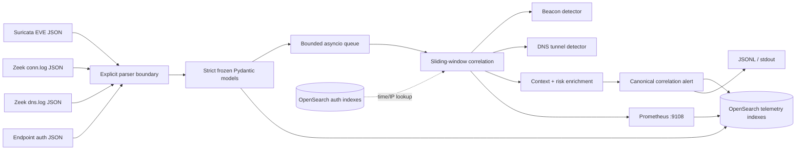

# IDS Telemetry Correlation Engine

A real-time network security monitoring (NSM) daemon that normalizes **Suricata EVE alerts**, **Zeek connection/DNS logs**, and **endpoint authentication events**, then correlates them into explainable C2 beaconing and DNS-tunneling detections.

The engine uses strict, frozen Pydantic schemas at the sensor boundary; bounded event-time sliding windows in the detection path; optional OpenSearch authentication lookups and bulk indexing; Prometheus metrics; and direct MITRE ATT&CK / NIST SP 800-53 Rev. 5 mappings on every correlation alert.

> This repository is a detection-engine reference implementation. Validate thresholds, capacity, retention, and availability against the target environment before treating it as a production control.

## What it does

| Capability | Implementation |
|---|---|
| Sensor normalization | Explicit Suricata EVE, Zeek `conn.log` / `dns.log`, and ECS-like auth parsers feeding frozen `extra="forbid"`, `strict=True` Pydantic models |
| C2 beacon detection | Per `(source, destination, port, transport)` windows; median period, median absolute jitter, coefficient of variation, and in-band interval scoring |
| DNS tunnel detection | Per `(client, registrable domain)` windows; encoded-label length, Shannon entropy, query uniqueness, rate, QTYPE, and negative-response scoring |
| Multi-source correlation | Temporal Suricata context plus local and OpenSearch endpoint-authentication matches; risk-based severity/confidence enrichment |
| OpenSearch output | Bounded asynchronous bulk queue, deterministic document IDs, daily indexes, strict templates, and a provisioned dashboard |
| Compliance metadata | MITRE T1071 / T1071.004 / T1048 and NIST SC-7 / SI-4 embedded as structured alert fields |
| Operations | Rotation-aware followers, queue backpressure, retrying bulk output, structured logs, Prometheus endpoint, SIEM metric snapshots, health check |
| Reproducible testing | Unit and integration fixtures, k-way event-time replay, strict Ruff/mypy gates, and a thresholded EPS benchmark |

## Data flow



See [Architecture](docs/ARCHITECTURE.md), [Detection engineering](docs/DETECTIONS.md), and [Operations](docs/OPERATIONS.md) for implementation and deployment details.

## Quick start

Requirements: Python 3.11+ (Docker is optional).

```bash
make install
make check

# Replay all bundled sensors in timestamp order.
make replay

# Show the two enriched alerts.
jq 'select(.kind == "correlation.alert") |
    {detection_type, severity, confidence,
     auth: (.authentication_matches | length),
     ids: [.mitre_attack[].technique_id],
     controls: [.nist_controls[].control_id]}' \
  data/output/replay.jsonl
```

Expected detector types are `c2_beaconing` and `dns_tunneling`. The fixture intentionally supplies related Suricata and failed-authentication events, so both alerts demonstrate cross-source enrichment.

Validate an individual sensor file without running the daemon:

```bash
.venv/bin/ids-telemetry validate suricata /var/log/suricata/eve.json
.venv/bin/ids-telemetry validate zeek-conn /var/log/zeek/conn.log
.venv/bin/ids-telemetry schema alert > alert.schema.json
```

## Run continuously

Configuration is loaded from `IDS_*` environment variables. Nested settings use `__`:

```bash
export IDS_SOURCE__SURICATA_PATH=/var/log/suricata/eve.json
export IDS_SOURCE__ZEEK_CONN_PATH=/var/log/zeek/conn.log
export IDS_SOURCE__ZEEK_DNS_PATH=/var/log/zeek/dns.log
export IDS_SOURCE__FOLLOW=true
export IDS_OPENSEARCH__ENABLED=false

.venv/bin/ids-telemetry run --from-beginning
```

CLI paths can be supplied instead of environment variables:

```bash
.venv/bin/ids-telemetry run \
  --suricata /var/log/suricata/eve.json \
  --zeek-conn /var/log/zeek/conn.log \
  --zeek-dns /var/log/zeek/dns.log
```

The follower waits for missing files and handles both truncate and inode-replacement rotation. Existing files are tailed from EOF unless `--from-beginning` is used. Malformed records are rejected with sensor, path, line, and field metadata; raw potentially sensitive records are not copied into logs.

A complete environment example is in [.env.example](.env.example).

## Docker Compose stack

The default stack includes the Python engine, single-node OpenSearch, OpenSearch Dashboards, index-template initialization, and dashboard import:

```bash
docker compose up --build -d
docker compose ps

# Metrics and dashboards
curl http://localhost:9108/metrics
open http://localhost:5601
```

Suricata and Zeek are optional because live packet capture requires additional capabilities. Their containers share the `sensor-netns` service's **Linux network namespace**, while the correlation engine remains isolated and capability-free:

```bash
docker compose --profile sensors up --build -d

# Offline PCAP exercise: put data/input/replay.pcap in place first.
docker compose --profile sensors --profile replay up --build traffic-replay
```

The Compose OpenSearch node deliberately disables the security plugin for local development and binds its API to loopback. Do not use that setting on an untrusted host; see the secured-cluster guidance in [Operations](docs/OPERATIONS.md).

## Detection output

Alerts are schema-versioned and idempotently keyed. A shortened example:

```json
{
  "kind": "correlation.alert",
  "detection_type": "c2_beaconing",
  "severity": "critical",
  "confidence": 1.0,
  "src_ip": "10.0.0.25",
  "dst_ip": "198.51.100.42",
  "evidence": {
    "connection_count": 8,
    "median_interval_seconds": 31.0,
    "median_absolute_jitter_ratio": 0.032258,
    "suricata_context_count": 1,
    "authentication_context_count": 2,
    "failed_authentication_count": 2
  },
  "mitre_attack": [{"technique_id": "T1071", "tactic": "Command and Control"}],
  "nist_controls": [
    {"control_id": "SC-7", "name": "Boundary Protection"},
    {"control_id": "SI-4", "name": "System Monitoring"}
  ]
}
```

The full object retains contributing event IDs, Suricata signature evidence, authentication principals/outcomes, detector statistics, descriptions, and mapping URLs.

## OpenSearch integration

When `IDS_OPENSEARCH__ENABLED=true`, the engine writes to:

- `ids-telemetry-events-YYYY.MM.DD`
- `ids-correlation-alerts-YYYY.MM.DD`
- `ids-engine-metrics-YYYY.MM.DD`

It queries `logs-endpoint.events.authentication-*` by default for records whose `host.ip`, `source.ip`, or `client.ip` matches either side of a candidate detection. Change this with `IDS_OPENSEARCH__AUTH_INDEX_PATTERN`.

Template mappings are under [`opensearch/templates`](opensearch/templates), and the importable overview dashboard is under [`opensearch/dashboards`](opensearch/dashboards). Deterministic `_id` values make replay indexing idempotent.

## Throughput benchmark

The benchmark measures JSON decoding, strict Pydantic normalization, and a stateful beacon-window update. It intentionally excludes filesystem/network transport and OpenSearch I/O so the result characterizes the correlation hot path rather than a particular cluster.

```bash
make benchmark
# or
.venv/bin/python scripts/benchmark.py --events 100000 --assert-eps 5000
```

The checked run in [`docs/benchmark-latest.json`](docs/benchmark-latest.json) processed 100,000 events at **8,346 EPS** on the Arena Linux sandbox (Python 3.11.2), exceeding the automated 5,000 EPS gate. Results are hardware- and tuning-dependent; rerun the command on deployment hardware and separately load-test OpenSearch.

## Quality gates

```bash
make test       # 53 unit/integration tests
make lint       # Ruff lint + formatting
make typecheck  # strict mypy
make check      # all three
make benchmark  # non-functional 5,000 EPS threshold
```

CI runs all static checks, the test suite with branch coverage, container build, and the benchmark gate. Fixtures use IANA documentation address ranges and contain no production data.

## Control and technique mapping

| Detection / telemetry behavior | MITRE ATT&CK | NIST SP 800-53 Rev. 5 |
|---|---|---|
| Periodic application-layer connections | T1071 Application Layer Protocol | SC-7 Boundary Protection; SI-4 System Monitoring |
| Encoded/high-entropy DNS C2 | T1071.004 DNS | SC-7; SI-4 |
| DNS-based alternate-protocol exfiltration | T1048 Exfiltration Over Alternative Protocol | SC-7; SI-4 |
| Suricata signature and endpoint-auth enrichment | Context, not an independent ATT&CK assertion | SI-4 event analysis and correlation support |

Mappings communicate detection intent; they do not by themselves establish control implementation or compliance.

## Repository layout

```text
src/ids_telemetry/
├── parsers/          # untrusted sensor boundary and explicit coercion
├── correlation/      # bounded windows, detectors, context, enrichment
├── ingest/           # rotation-aware tailing and timestamp-merged replay
├── opensearch/       # client and endpoint-auth query adapter
├── sinks/            # JSONL routing and async bulk indexing
├── models.py         # canonical strict schemas and ATT&CK/NIST objects
├── daemon.py         # lifecycle, backpressure, metrics, shutdown
└── cli.py
tests/                # unit, integration, and sanitized sensor fixtures
opensearch/           # strict templates and saved dashboard objects
suricata/ + zeek/     # sensor policy used by optional Compose profiles
scripts/benchmark.py  # deterministic EPS benchmark and threshold gate
```

## License

[MIT](LICENSE)
